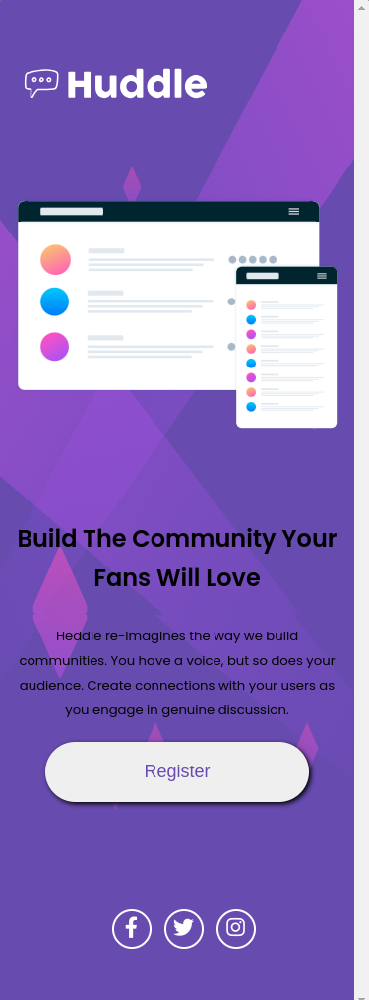

# Frontend Mentor - Huddle landing page with single introductory section solution

This is a solution to the [Huddle landing page with single introductory section challenge on Frontend Mentor](https://www.frontendmentor.io/challenges/huddle-landing-page-with-a-single-introductory-section-B_2Wvxgi0). Frontend Mentor challenges help you improve your coding skills by building realistic projects.

## Table of contents

- [Overview](#overview)
  - [The challenge](#the-challenge)
  - [Screenshot](#screenshot)
  - [Links](#links)
- [My process](#my-process)
  - [Built with](#built-with)
  - [What I learned](#what-i-learned)
  - [Continued development](#continued-development)
  - [Useful resources](#useful-resources)
- [Author](#author)

## Overview

### The challenge

Users should be able to:

- View the optimal layout for the site depending on their device's screen size

### Screenshot




### Links

- Solution URL: [Solution URL here](#)
- Live Site URL: [Live site URL here](#)

## My process

### Built with

<code></code>
<code></code>


### What I learned

I used [display: grid] to structure the page's body, as it was the topic I found most challenging. I also liked in this project the way it divides the HTML into four parts: the background (picture), header, main content, and footer. I adopted a method to create the main parts of the HTML mentioned earlier and then proceeded to create the elements that are inside these parts along with their CSS.

Here's one of the sections, in HTML and CSS:

```html
<header class="header">
  
</header>
```
```css
/* HEADER */

.header{
    grid-area: header;

}

.header .logo{
    height: 60px;
}

```

### Continued development

I'll choose another project that is more related to a landing page since I believe it incorporates everything I've learned so far.

### Useful resources
- [W3Schools](https://www.w3schools.com/css/default.asp) - 
I used W3Schools to clarify my doubts and I really liked their examples, which clarify how to use CSS properties.
- [MDN Web Docs](https://developer.mozilla.org/pt-BR/) - I'd like you to get to know MDN Web Docs, which helped me a lot in understanding HTML tags.

## Author

- Frontend Mentor - [@Otaviano-Manoel](https://www.frontendmentor.io/profile/Otaviano-Manoel)